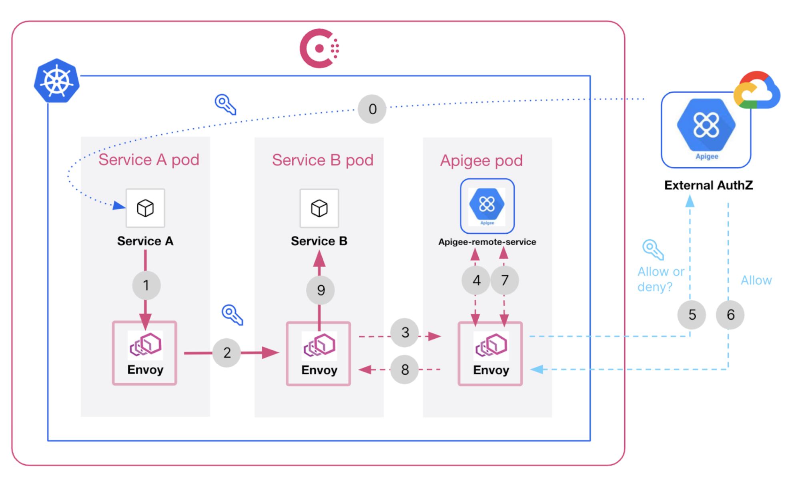

# consul-k8s-apigee-x



## Apigee X used for ext_authz with Consul Service Mesh

Following instructions are taken from the [terraform module here](https://github.com/apigee/terraform-modules), please refer to this repo for issues and further assistance.

## Prerequisites

The following must be installed on your local machine, these commands might run in [local-exec](https://registry.terraform.io/providers/hashicorp/null/latest/docs/resources/resource)

```
* terraform
* gcloud
* curl
* tar
* yq
```

### Select a GCP project

* Select the GCP project to install resources

```sh
export PROJECT_ID=xxx
export TF_VAR_project_id=xxx
gcloud config set project $PROJECT_ID
gcloud auth login
```

## Create the GKE & Apigee
```
terraform -chdir=infra init
terraform -chdir=infra apply -auto-approve
```

## Configure the GKE & Apigee

```
export APIGEE_ACCESS_TOKEN="$(gcloud config config-helper --force-auth-refresh | grep access_token | grep -o -E '[^ ]+$')";

terraform -chdir=app init
terraform -chdir=app apply -auto-approve
```

## Retrieve the GKE & Apigee credentials locally

```
gcloud container clusters get-credentials \
	$(terraform -chdir=infra output -raw gke_cluster_name) \
    --region $(terraform -chdir=infra output -raw region)

export APIGEE_DEV_API_KEY="$(terraform -chdir=app output apigee_developer_key)"
```


* Ping the httpbin service from curl service again

```sh
kubectl exec -it deployment/curl -- /bin/sh
curl -i httpbin.default.svc.cluster.local/headers
```

* The response should be HTTP/1.1 403 Forbidden

```sh
HTTP/1.1 403 Forbidden
date: Thu, 99 XX 20XX XX:XX:XX GMT
server: envoy
content-length: 0
x-envoy-upstream-service-time: 3
```

> **_NOTE:_** You might have to ping a few times here.

```sh
kubectl exec -it deployment/curl -- /bin/sh
curl -i httpbin.default.svc.cluster.local/headers -H "x-api-key: ${APIGEE_DEV_API_KEY}"
```

```sh
HTTP/1.1 200 OK
server: envoy
date: Thu, 99 XX 20XX XX:XX:XX GMT
content-type: application/json
content-length: 2727
access-control-allow-origin: *
access-control-allow-credentials: true
x-envoy-upstream-service-time: 22
{
    "headers": {
        "Accept": "*/*", 
        "Host": "httpbin.default.svc.cluster.local", 
        "User-Agent": "curl/8.2.0", 
        "X-Api-Key": "developer_client_key_goes_here", 
        "X-Apigee-Accesstoken": "", 
        "X-Apigee-Api": "httpbin.default.svc.cluster.local", 
        "X-Apigee-Apiproducts": "httpbin-product", 
        "X-Apigee-Application": "httpbin-app", 
        "X-Apigee-Authorized": "true", 
        "X-Apigee-Clientid": "developer_client_key_goes_here", 
        "X-Apigee-Developeremail": "ahamilton@example.com", 
        "X-Apigee-Environment": "env", 
        "X-Apigee-Organization": "GCP_ORG_ID", 
        "X-Apigee-Scope": "", 
        "X-Envoy-Expected-Rq-Timeout-Ms": "15000",
        "X-Forwarded-Client-Cert": "--cert-redacted--"
    }
}
```

### Clean up

Destroy the app configuration first, then infrastructure

```sh
terraform -chdir=app destroy -auto-approve
terraform -chdir=infra destroy -auto-approve
```
